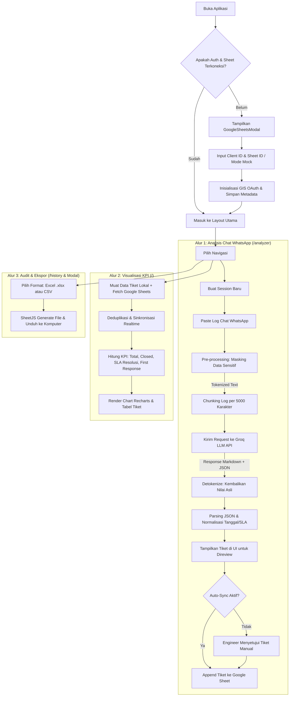

# Analisis Arsitektur, Tech Stack, dan Flow Aplikasi Dashboard (ITSM Timesheet App)

Dokumen ini menyajikan hasil analisis mendalam terhadap source code aplikasi pada folder [dashboard](file:///e:/IT-WA-OPS/dashboard) (`itsm-timesheet-app`).

---

## 1. Ringkasan Eksekutif

Aplikasi **ITSM NAC BNI Timesheet Analyzer** (`dashboard`) adalah aplikasi web berbasis React (SPA) yang dirancang khusus untuk mempermudah tim Security Engineer / Network Access Control (NAC) BNI dalam mengubah percakapan log obrolan WhatsApp menjadi tiket timesheet ITSM yang terstruktur, rapi, dan terstandar, lalu menyinkronkannya secara otomatis ke Google Sheets serta memvisualisasikannya dalam bentuk KPI Dashboard analitik.

### Posisi dalam Ekosistem `IT-WA-OPS`:
* **`wa-gmail-forwarder`**: Mengambil pesan dari grup WhatsApp operasional secara otomatis via Baileys.
* **`gas-nac-ticket-intake`**: Menangani intake backend di Google Apps Script dan Google Sheets.
* **`dashboard` (Aplikasi ini)**: Menyediakan interface web bagi engineer/operator untuk menganalisis log WhatsApp (baik manual paste maupun riwayat session), melakukan review/editing tiket, monitoring KPI (SLA penyelesaian & response time), serta sinkronisasi dua arah dengan Google Sheets.

---

## 2. Analisis Tech Stack

| Kategori | Teknologi / Library | Versi | Peran & Alasan Penggunaan |
|---|---|---|---|
| **Core Framework** | **React** | `^18.2.0` | UI component-based library untuk interaktivitas dinamis |
| **Build Tool & Bundler** | **Vite** | `^5.0.8` | Tooling modern dengan Hot Module Replacement (HMR) yang sangat cepat |
| **Routing** | **React Router DOM** | `^7.18.1` | Client-side routing (`/`, `/analyzer`, `/history`, `/settings`) |
| **Styling & CSS** | **Tailwind CSS** + **Autoprefixer** | `^3.3.6` | Utility-first styling dengan dukungan tema kustom (dark mode & BNI orange) |
| **Animations** | **Framer Motion** | `^12.42.2` | Transisi halaman, stagger list, dan micro-interaction yang smooth |
| **Iconography** | **Lucide React** | `^0.294.0` | Set icon modern dan ringan |
| **Data Visualization** | **Recharts** | `^3.9.2` | Grafik interaktif (Bar Chart, Pie Chart, Line Chart SLA/volume) |
| **Spreadsheet Export** | **SheetJS (`xlsx`)** | `^0.18.5` | Konversi dan unduhan tiket ke format file `.xlsx` / `.csv` lokal |
| **AI LLM Engine** | **Groq Cloud API** *(Primary)* | REST | Ekstraksi tiket cepat menggunakan model LLM (default: `openai/gpt-oss-120b`) |
| **AI Fallback** | **Google Gemini API** *(Secondary)* | REST | Fallback model `gemini-3.6-flash` via interaction API |
| **Autentikasi Cloud** | **Google Identity Services (GIS)** | Web SDK | OAuth 2.0 Token Client untuk akses spreadsheet user secara aman |
| **Database / Storage** | **Google Sheets API v4** + **LocalStorage** | REST | Penyimpanan spreadsheet cloud dan cache session/preferensi lokal |

---

## 3. Struktur Direktori & Komponen

```text
dashboard/
├── index.html                  # Entry point HTML & GIS script loading
├── vite.config.js              # Konfigurasi Vite & React plugin
├── tailwind.config.js          # Palet warna, font, dan animasi Tailwind
├── package.json                # Dependensi dan script npm (dev, build, preview)
├── src/
│   ├── main.jsx                # Render React root ke DOM
│   ├── App.jsx                 # Routing, AuthProvider, SessionProvider, ErrorBoundary
│   ├── components/             # 21 Komponen UI reusable:
│   │   ├── ModernAppLayout.jsx # Sidebar navigasi, breadcrumb, responsivitas
│   │   ├── ModernHeader.jsx    # Header bar atas (status sync, mode toggle)
│   │   ├── ModernDataTable.jsx # Tabel tiket dengan filter & inline action
│   │   ├── ModernKPICard.jsx   # Kartu metrik KPI dashboard
│   │   ├── MessageList.jsx     # Tampilan chat bubble input & output AI
│   │   ├── ChatInput.jsx       # Textarea untuk paste log WhatsApp
│   │   ├── GoogleSheetsModal   # Modal koneksi Client ID & Sheet ID
│   │   ├── ExportModal.jsx     # Modal unduh Excel / CSV
│   │   ├── RateLimitIndicator  # Bar monitoring estimasi TPM / batas token Groq
│   │   └── ...
│   ├── context/
│   │   ├── AuthContext.jsx     # Manajemen OAuth GIS Google, Sheet ID, dark mode, custom rules
│   │   └── SessionContext.jsx  # Manajemen sesi analisis, riwayat chat, dan storage tiket
│   ├── hooks/
│   │   ├── useAnalysis.js      # Orchestrator tokenization -> Groq AI -> parsing -> auto sync
│   │   └── useSheetsSync.js    # Sinkronisasi data Sheets, audit lokal vs cloud, deduplikasi
│   ├── lib/
│   │   ├── tokenizer.js        # Data sanitization (masking MAC, IP, HP, NPP sebelum dikirim ke AI)
│   │   ├── systemPrompt.js     # Prompt engineering dengan domain knowledge NAC BNI
│   │   ├── groqApi.js          # Client API Groq dengan rotasi multi-API key & rate limit handling
│   │   ├── geminiApi.js        # Client API Google Gemini (fallback)
│   │   ├── googleAuth.js       # Inisialisasi GIS OAuth 2.0 & silent token refresh
│   │   ├── googleSheetsApi.js  # REST call batchUpdate / appendCells ke Google Sheets
│   │   ├── ticketParser.js     # Ekstraksi JSON dari output AI, normalisasi tanggal & SLA
│   │   └── storageUtils.js     # Wrapper LocalStorage aman terhadap kuota browser
│   ├── pages/
│   │   ├── ModernDashboardPage # Dashboard analitik KPI, chart Recharts, SLA trend
│   │   ├── ModernAnalyzerPage  # Workspace paste log chat, ekstraksi AI, review tiket
│   │   ├── ModernHistoryPage   # Riwayat session masa lalu & filter pencarian
│   │   └── ModernSettingsPage  # Pengaturan API key, aturan kustom, tema, & disconnect
│   └── utils/
│       ├── dateUtils.js        # Konversi waktu, durasi resolusi, kalkulasi tanggal M/D/YYYY
│       └── ticketUtils.js      # Agregasi data tiket, penghitungan SLA, filtering, deduplikasi
```

---

## 4. Alur Kerja Aplikasi (Application Flow)

Diagram alur kerja end-to-end aplikasi:



### Rincian Tahapan Alur:

### 1. Inisialisasi & Autentikasi
* Menggunakan **Google Identity Services (GIS)** via script `https://accounts.google.com/gsi/client`.
* Saat pertama dibuka, aplikasi meminta **Google OAuth Client ID** dan **Google Sheet ID**.
* **Keamanan Token**: `accessToken` **tidak pernah disimpan di `localStorage`**. Aplikasi hanya menyimpan `{ clientId, expiresAt }`. Ketika halaman direfresh, sistem menggunakan `silentAuth({ prompt: '' })` tanpa memicu popup mengganggu bagi user.
* **Fitur Offline / Mock Testing**: Memasukkan `mock` atau `offline` sebagai Client ID akan memicu mode simulasi instan tanpa perlu akun Google Cloud.

### 2. Sanitasi & Masking Data Sensitif (`tokenizer.js`)
Sebelum chat dikirim ke server AI publik (Groq/Gemini), sistem melakukan sanitasi berbasis regex:
* **MAC Address** diubah menjadi `[MAC_0]`, `[MAC_1]`, dst.
* **IPv4 Address** diubah menjadi `[IP_0]`, `[IP_1]`, dst.
* **Nomor HP Indonesia** (+62, 08xx) diubah menjadi `[PHONE_0]`, dst.
* **NPP Pegawai BNI** (`P055677`, `NPP 901511`) diubah menjadi `[NPP_0]`, dst.
Hal ini menjamin kepatuhan privasi data perbankan sebelum payload keluar ke internet.

### 3. Ekstraksi AI & Auto Chunking (`useAnalysis.js` & `groqApi.js`)
* Log chat yang panjang dipecah ke dalam chunk maksimal 5.000 karakter.
* Jika server mengembalikan status `413 (Request Too Large / TPM Limit)`, algoritma otomatis membagi dua ukuran chunk (`currentChunkSize / 2`) dan mencoba kembali secara adaptif.
* Mendukung rotasi beberapa API Key Groq sekaligus untuk menghindari batas rate limit (TPM/TPD).
* System prompt memiliki domain knowledge khusus NAC BNI (pemetaan site Menara BNI, Citicon, Plaza BNI, aturan keyword whitelist menjadi *Service Request*, dan aturan bahasa formal English).

### 4. Normalisasi & Detokenisasi (`ticketParser.js`)
* Respon AI dibersihkan dari blok markdown ` ```json ... ``` `.
* Seluruh token `[MAC_X]`, `[IP_X]`, `[NPP_X]` dikembalikan (*detokenize*) ke nilai aslinya.
* Tanggal format WhatsApp Indonesia `DD/MM/YYYY` dikonversi ke format standar Google Sheets `M/D/YYYY`.
* Waktu respons pertama (*First Response Time*) dan durasi pengerjaan (*Resolution Time*) dihitung otomatis dari timestamp obrolan WhatsApp.

### 5. Sinkronisasi Google Sheets (`googleSheetsApi.js`)
* Mengecek nomor baris terakhir di kolom A pada sheet tujuan untuk menentukan nomor tiket berikutnya secara urut.
* Jika sheet kosong, otomatis menambahkan 16 kolom header terformat bold dengan background abu-abu.
* Menggunakan Google Sheets API endpoint `:batchUpdate` (`appendCells`) agar penambahan baris efisien.

### 6. Analisis Dashboard & Ekspor
* Menghitung SLA rata-rata penyelesaian masalah, distribusi tipe tiket (*Problem*, *Service Request*, *Change Request*, *Incident*), serta lokasi pelapor terbanyak.
* Menyediakan audit komparasi: mencocokkan tiket di penyimpanan browser lokal dengan data aktual di Google Sheets untuk menemukan tiket yang belum tersinkronisasi.
* Ekspor langsung ke file `.xlsx` dan `.csv` menggunakan SheetJS.

---

## 5. Fitur Unggulan & Praktik Terbaik

1. **Privasi Data Perbankan (Tokenization Guard)**: Data sensitif jaringan dan identitas karyawan disamarkan sebelum dianalisis oleh AI pihak ketiga.
2. **Resilience terhadap Rate Limit AI**: Dukungan multi-key Groq, estimasi token real-time, auto chunking dinamis, dan fallback ke model alternatif.
3. **Penyimpanan Lokal yang Aman**: Modul `storageUtils.js` membungkus `localStorage` dengan penanganan kuota penuh dan fallback memory storage sementara.
4. **Desain Modern & Responsif**: Menggunakan palet gelap profesional, aksen warna BNI, micro-animation Framer Motion, serta komponen Recharts yang responsif.
5. **Dukungan Offline/Mock**: Memungkinkan demonstrasi dan testing fitur tanpa harus mengatur OAuth Google Cloud Console terlebih dahulu.

---

## 6. Struktur Kolom Data Tiket (16 Kolom)

Setiap tiket yang diekstraksi dan disimpan ke Google Sheet memiliki skema standar berikut:

| No | Nama Kolom | Contoh Data | Deskripsi |
|---|---|---|---|
| 1 | `No` | `102` | Nomor tiket berurutan otomatis |
| 2 | `Source` | `WhatsApp` | Sumber data pelaporan |
| 3 | `Type` | `Service Request` | Tipe tiket (`Problem`, `Service Request`, `Change Request`, `Incident`) |
| 4 | `Requester` | `User - BNI Citicon` | Lokasi atau unit pelapor |
| 5 | `Period` | `July` | Bulan pengerjaan |
| 6 | `Year` | `2026` | Tahun pengerjaan |
| 7 | `Problem/Issue` | `Request to whitelist device for intranet access at Citicon (Rizky/P055677)` | Deskripsi masalah formal bahasa Inggris |
| 8 | `Action` | `Device has been whitelisted on Cisco ISE` | Tindakan penyelesaian |
| 9 | `Date` | `7/2/2026` | Tanggal pengerjaan (M/D/YYYY) |
| 10 | `Task Started` | `7/2/2026 10:15` | Waktu mulai |
| 11 | `Task Finished` | `7/2/2026 10:45` | Waktu selesai |
| 12 | `Resolution Time`| `0:30:00` | Durasi penyelesaian (H:MM:SS) |
| 13 | `First Response Time`| `0:02:00` | Waktu respon pertama engineer |
| 14 | `Status` | `CLOSED` | Status tiket (`OPEN` atau `CLOSED`) |
| 15 | `Engineer` | `ITSM NAC BNI` | Nama tim / engineer yang menangani |
| 16 | `Remarks` | `Support Whitelist` | Catatan penutup formal |

---

## 7. Rekomendasi Integrasi dengan Folder Lain di Workspace

Aplikasi dashboard ini dapat disinergikan langsung dengan modul yang sudah ada di workspace `e:\IT-WA-OPS`:
* **Integrasi dengan `wa-gmail-forwarder`**:
  Tiket JSON yang dihasilkan oleh forwarder (misal: `tickets/205978142285842_lid_tickets.json`) dapat di-import langsung ke dashboard untuk divisualisasikan grafiknya atau digabungkan ke Google Sheets utama.
* **Integrasi dengan `gas-nac-ticket-intake`**:
  Spreadsheet ID yang sama dapat digunakan bersama oleh Google Apps Script dan dashboard frontend ini, sehingga data tiket yang masuk dari berbagai saluran (Email / WhatsApp Bot / Dashboard Web) bermuara pada satu Google Sheet yang konsisten.
